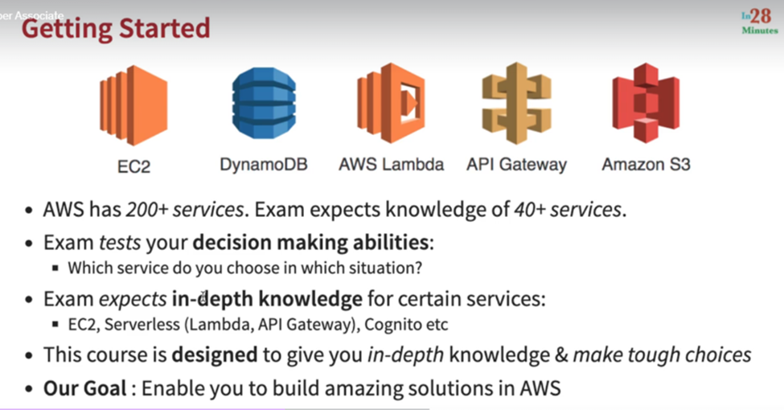
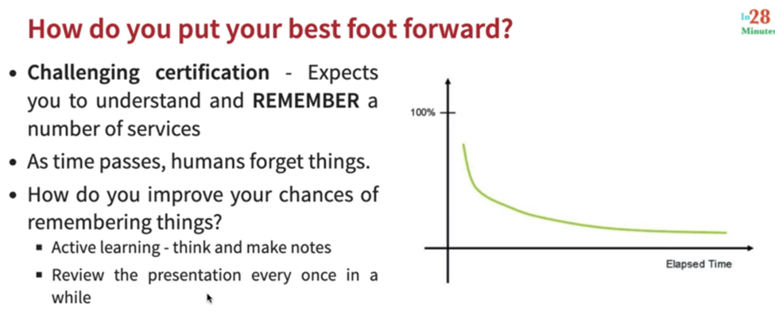

# 1. Section-1
#  1. Introduction

- reinforce
    - strengthen or supporT
# 2. Course Overview
Overwiew regarding each section simply introduction.
# 3. Course Download pdf
https://github.com/in28minutes/course-material/blob/main/03-aws-certified-developer-associate/downloads.md
# 2. Section-2 Getting Started with Cloud and AWS - Regions and AZ
# 4. Step-1 Introduction to Cloud and AWS

- 1,2 points slide mein dekhe
3) Apne Application par peak load ke samay 10K users apne app ko hit karne wale hai.
    - so humko aisa infrastructure procure karna honga jo 10k users ko handle kar pave.
### Challenge

- jo infrastructure humne procure kiya hai
    - jab peak load hai tab badhiya kaam kar raha hai
    - par jab peak load nhi rahenga tab kya idle baithega.
### Solution

- provision
    - the action of providing and supplying sth for use.
- Undiffrentiate Heavy lifting
    - Appko db chaiye jo ki highly available ho and highly durable ho
    - Toh cloud ye bahut sari managed services provide karta hai
    - simply aap cloud mein checkbox select karo aapko db mil javenga.
    - aapko us db ko install karne ya maintain karne par focus nhi karna
    - aapko apne business logic banane mein focus karna hai ye hi competative edge aapko dilwaenga.
### Why AWS?

- competitior hai GCP and Azure

